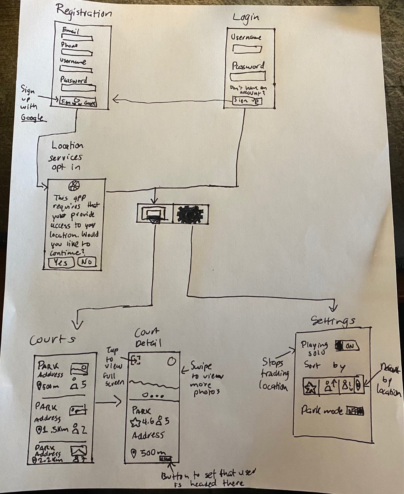

Original App Design Project - Sebastián Saldaña
===

# Court Finder

## Table of Contents
1. [Overview](#Overview)
1. [Product Spec](#Product-Spec)
1. [Wireframes](#Wireframes)
2. [Schema](#Schema)

## Overview
### Description
Users can view courts that are nearest to them and the app tells them if there is anyone at that court that is playing at the time or plan to go in a short while.

### App Evaluation
- **Category:** Health & Fitness / Social
- **Mobile:** The app would use location services and require users to take their phone with them to the park to tell if there is someone there. 
- **Story:** Allows users who feel like playing a basketball game to check where they can play that is nearest to them and if there is actually someone there that they can play with, or if someone else plans to go at the time and have not arrived yet. 
- **Market:** Any person who likes to play basketball. 
- **Habit:** Users would check this app first before leaving home to play a pickup game to know if it is actually worth going at that time
- **Scope:** The first version of this app could only include the main purpose of listing parks, allowing users to view that park's status in termos of players and set whether they are planning to go there. Future versions could include features that make it more immersive such as being able to share highlights for a specific park or allowing users to display their stats at a specific court. 

## Product Spec

### 1. User Stories (Required and Optional)

**Required Must-have Stories**

* User can sign up for an account.
* User can login to their account.
* User can opt in to allowing location services to be used.
* User can view basketball courts.
* User can view how many people there are at a given court.
* User can select a court they are headed to. 
* User can view details of the park including rating and photos of the court.

**Optional Nice-to-have Stories**
* User can post highlights recorded from a game and associate it with a court.
* User can record their stats for a given date on a specific court. 
* User can rate a court.
* User can search for a court.
* User can customize the way courts are sorted on the main Courts screen. 

### 2. Screen Archetypes

* Login Screen
   * User can login to their account. 
* Registration Screen
    * User can sign up for an account.
    * User can opt in to allowing location services to be used.
* Courts Screen
   * User can view basketball courts.
   * User can view how many people there are at a given court.
   * User can select a court they are headed to. 
   * User can search for a court.
* Court Detail Screen
    * User can view details of the park including rating and photos of the court.
    * User can rate a court.
### 3. Navigation

**Tab Navigation** (Tab to Screen)

* Courts
* User Settings

*For optional user stories*
* View Highlights
* Record Stats

**Flow Navigation** (Screen to Screen)

* Login Screen
   => Courts 
* Registration Screen
   => Courts
* Courts Screen
   => Court Detail Screen

## Wireframes

## Schema 
### Models
#### Users 
| Property | Type | Description |
| -------- | ---- | ----------- |
| objectId | String | unique id for the user (default field) |
| emailVerified | Boolean | says if user has verified their email or not (default field) |
| updatedAt | Date | timestamp for when the user was last modified (default field) |
| authData | Object | JSON object that stores other Auth data such as Oauth information (default field) |
| username | String | Username to identify a user (default field) |
| createdAt | Date | timestamp for when the user was created (default field) |
| password | String | password for user (default field) |
| email | String | user's email (default field) |
| phone | String | user's phone number |
| headedToPark | String | Google Maps ID string that identifies the park the person is headed to (may be null in some rows) |
| lastSetHeadedToPark | Date | Timestamp for last time the user clicked on OMW button (may be null in some rows) |
#### Courts 
NOTE: This model will not exist on Parse DB. This is designed to facilitate the manipulation of data retrieved from Google Maps API. 
| Property | Type | Description |
| -------- | ---- | ----------- |
| placeID | String | Google Maps place ID |
| address | String | Address fetched from Google Maps API |
| rating | Float | Rating fetched from Google Maps API |
| distanceFromUser | Float | Calculated distance using current user location and returned geolocation from Google Maps API |
| players | Int | calculated field that holds the amount of players at a park |
| photos | NSArray | array that holds the photos for the park |

### Networking
- Courts Screen 
  - (Read/GET) Query Google Maps Place Search endpoint
  - (Read/GET) Query Google Maps Place Details endpoint
  - (Read/GET) Query Google Maps Place Photos endpoint 
- Courts Detail Screen
  - (Update/PUT) Update headedToPark field  
- [OPTIONAL: List endpoints if using existing API such as Yelp]
  - Place search (get the place IDs for something that is of type *park* or *basketball court*)
    Endpoint - https://maps.googleapis.com/maps/api/place/nearbysearch/output?parameters
    Documentation - https://developers.google.com/maps/documentation/places/web-service/search#PlaceSearchRequests
  - Place details (get the place details) 
    Endpoint - Google Maps Places SDK for iOS
    Documentation - https://developers.google.com/maps/documentation/places/ios-sdk/place-details?hl=en
  - Place photos (get the place photos)
    Endpoint - Google Maps Places SDK for iOS
    Documentation - https://developers.google.com/maps/documentation/places/ios-sdk/photos?hl=en
